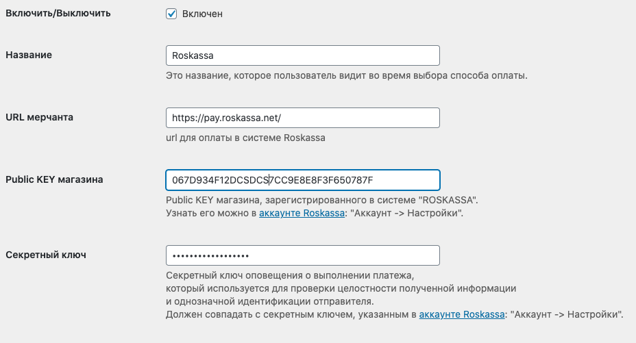

# Установка и настройка модуля Wordpress

### Настройка магазина

В [настройках](https://my.roskassa.net/shop-settings/) магазина необходимо заполнить следующие данные \(вместо **ВашСайт** введите доменное имя своего сайта\):

|  |  |
| :--- | :--- |
| Success URL | https://ВашСайт/?wc-api=wc\_roskassa&roskassa=success |
| Fail URL | https://ВашСайт/?wc-api=wc\_roskassa&roskassa=fail |
| URL уведомлений | http://ВашСайт/?wc-api=wc\_roskassa&roskassa=result |

### Установка модуля

Скачайте архив с последней версией готового модуля WordPress на соответствующей странице:



Перейдите на страницу установки плагинов на Вашем сайте и нажмите "Загрузить плагин"

Загрузите архив

И нажмите "Активировать"

### Настройка модуля

Откройте страницу "WooCommerce - Настройки"

Перейдите по вкладке "Платежи"

И выберите плагин "Roskassa"

 

Заполните необходимые данные и сохраните настройки

Поздравляем, теперь Вы можете принимать платежи через Roskassa!

